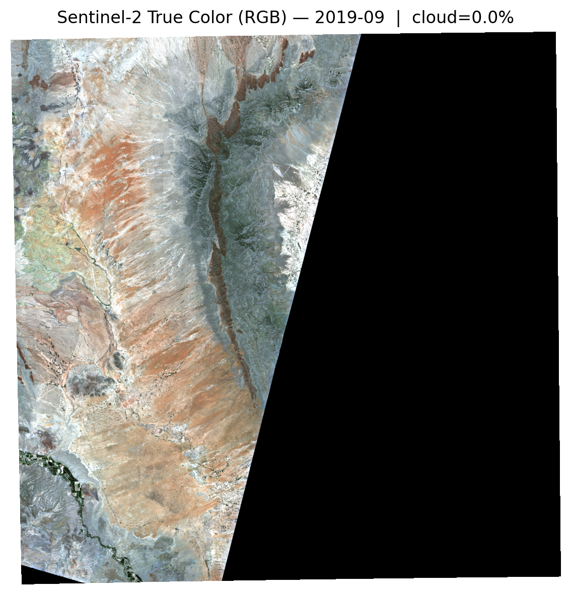
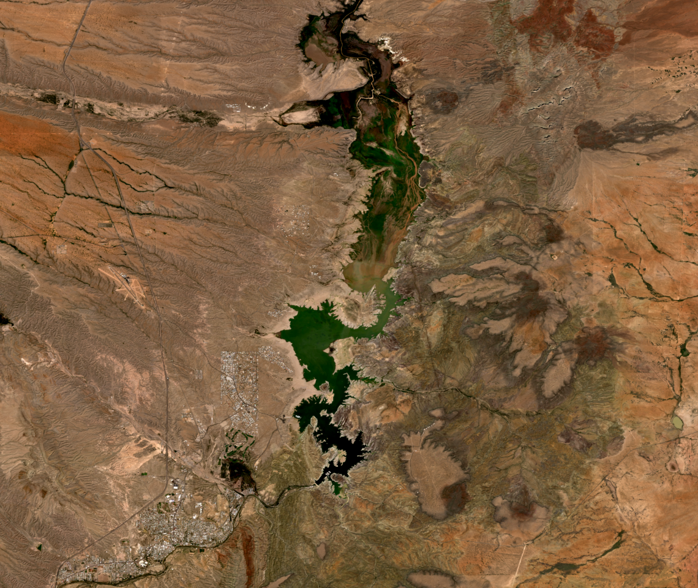
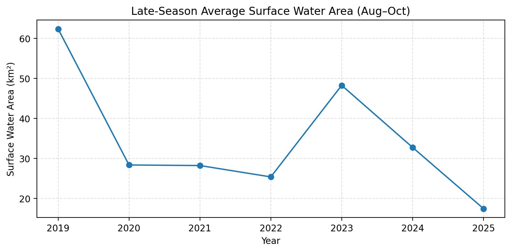
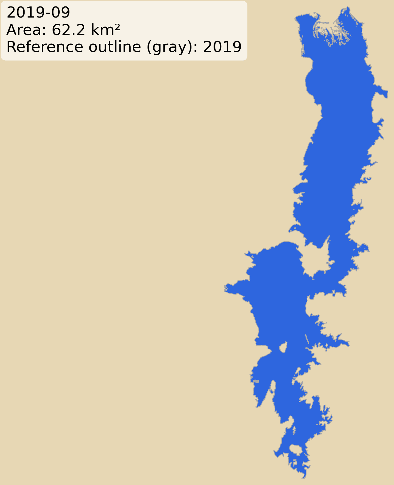

# Remote Sensing of Surface Water Dynamics — Elephant Butte Reservoir
## Sentinel-2 (2019–2025)

## Study Area


Elephant Butte Reservoir is a major Rio Grande reservoir in southern New Mexico. This project develops a reproducible remote sensing workflow to monitor seasonal and interannual surface water dynamics using Sentinel-2 satellite imagery.

Such workflows can support reservoir monitoring, drought assessment, and climate resilience planning by providing consistent, satellite-derived surface water indicators.

## Project Goal

Quantify seasonal and interannual surface water extent using optical satellite imagery and the Normalized Difference Water Index (NDWI).

This project emphasizes:

- Remote sensing engineering
- Spatiotemporal analysis
- Transparent, interpretable methods
- Reproducible open-source workflows
- Separation between analysis and visualization pipelines

## Core Questions

- How does surface water extent vary seasonally?
- How stable are interannual comparisons when using late-season metrics?
- What is gained by separating quantitative metrics from visual context imagery?

## Visual Context (True Color RGB)


The true-color imagery illustrates a visibly larger reservoir surface extent in September 2019 compared to September 2025. Darker tones correspond to open water, highlighting differences in shoreline position and overall surface coverage between years.

True-color median composites were generated in Google Earth Engine using Sentinel-2 L2A surface reflectance. Visualization parameters were explicitly controlled to ensure consistent brightness and contrast across years, enabling reliable visual comparison.


<table>
  <tr>
    <th>September 2019</th>
    <th>September 2025</th>
  </tr>
  <tr>
    <td></td>
    <td></td>
  </tr>
</table>


## Results

The time-series plot and story frames below are designed to complement each other (thus placed side-by-side): 
* plot: Late-Season (Aug-Oct averaged) Surface Water Area (one value per year)
* animation frames: September Surface Water Mask 2019–2025 Animation (one map per year)


### (1) Late-Season Surface Water Area Plot (bottom left )

The plot on the left represents the late-season (August–October) surface water area for each year.

Surface water extent was derived from Sentinel-2 imagery using the Normalized Difference Water Index (NDWI). 
*I evaluated NDWI first because it performs well in open-water reservoirs and allowed me to focus on pipeline robustness and temporal diagnostics. MNDWI would be a natural follow-up refinement.*

For each month, a median composite was generated, NDWI was computed, and pixels exceeding a defined threshold were classified as water. Surface area was calculated by summing water-classified pixels at 10 m resolution.

Between 2019 and 2025, late-season surface area fluctuated substantially. In 2019, the reservoir covered approximately 62 km² during the late season. Surface area declined in subsequent years, rebounded in 2023, and reached a late-season minimum of approximately 16 km² by 2025.

This pattern highlights interannual variability rather than a simple monotonic decline.

To reduce intra-seasonal variability, monthly surface area values were averaged across August–October for each year.

This late-season metric:

- Reduces short-term inflow noise  
- Captures end-of-season reservoir conditions  
- Provides a more stable basis for interannual comparison  

### (2) September Surface Water Mask 2019–2025 Animation (bottom right)
The animation on the right shows the September binary surface water mask derived from NDWI thresholding (2019–2025). 

Each frame is based on a monthly median Sentinel-2 composite. Pixels exceeding the NDWI threshold are classified as water, revealing spatial changes in reservoir extent at the end of the dry season.


<table>
  <tr>
    <th>Late-Season Surface Water Area (Aug–Oct)</th>
    <th>September Surface Water Mask (2019–2025)</th>
  </tr>
  <tr>
    <td valign="top">
      
    </td>
    <td valign="top">
      
    </td>
  </tr>
</table>

## Key Observations

- Surface water extent exhibits strong seasonal variability.
- Late-season averages provide a more stable signal than single-month comparisons.
- The reservoir does not exhibit a simple monotonic decline over 2019–2025.
- Metric selection matters when interpreting satellite-derived surface water dynamics.


## Methods Overview

### Data Sources

- Sentinel-2 L2A (Surface Reflectance) [Bands used: Green (B03), NIR (B08), and Scene Classification Layer (SCL)]

- Accessed via Microsoft Planetary Computer (STAC + ODC)
- RGB composites generated in Google Earth Engine for presentation

### Water Detection

    1. For each month, Sentinel-2 scenes are searched via STAC and clipped to the AOI.
    2. A clear/valid mask is computed from SCL to exclude clouds, cloud-shadow, snow/ice, and invalid pixels.
    3. NDWI is computed and composited as a monthly median across valid observations.
    4. A fixed NDWI threshold is applied to classify water, and water area is calculated from pixel area.

### QA metrics
Each month outputs contained:
    • water_area_km2
    • median_valid_fraction (median fraction of valid observations across the AOI)
    • valid_fraction_any (fraction of pixels with at least one valid observation)
    • n_items (number of Sentinel-2 items used)

### Processing Workflow

1. STAC-based imagery search and loading  
2. QA60 cloud masking  
3. Monthly median compositing  
4. NDWI computation (NDWI = (Green - NIR) / (Green + NIR))  
5. Threshold-based binary water masking  
6. Pixel-area aggregation (10 m resolution)  
7. Late-season averaging (Aug–Oct)  

## Engineering Design

- Modular `src/` architecture
- Explicit band selection (no hidden defaults)
- Dask-aware computation
- Materialized reference masks to avoid redundant reads
- Separation of analysis and visualization pipelines
- Reproducible export workflows

## Repository Structure
- configs/ AOI, time range, NDWI settings
- src/ STAC access, compositing, NDWI, masking, metrics
- notebooks/ Narrative exploration and visualization
- outputs/ Figures, maps, tables
- docs/ Method notes and interpretation
- data/ Cached imagery and intermediates (gitignored)


## Outputs

- `outputs/tables/water_area_timeseries.csv`
- `outputs/tables/water_area_summary_metrics.csv`
- `outputs/figures/lateseason_avg_surfacearea.jpg`
- `outputs/maps/story_sept_2019_2025_2000ms.gif`
- `outputs/images/s2_rgb_2019-09.png`
- `outputs/images/s2_rgb_2025-09.png`


## Reproducibility

Create the project structure:

```bash
bash scripts/bootstrap_repo.sh
```

## High-level workflow:

1. Create environment
2. Run monthly processing pipeline
3. Generate summary metrics
4. Export visual assets


## Notes and limitations
    * Surface-water area (km²) is not the same as reservoir storage (acre-feet). Storage depends on bathymetry and stage–storage relationships.
    * Remote sensing observations vary in quality by month/year; QA metrics are reported to support interpretation.

## Data quality metrics 
Each month includes many satellite images, but clouds and missing data mean not all images are usable everywhere.
To make data quality explicit:

* median_valid_fraction
    *  Tells us how consistently clear the month was.
    * It is the median fraction of usable satellite images across pixels in the area of interest.

* valid_fraction_any
    * Tells us whether the area was covered at all.
    * It is the fraction of pixels that had at least one clear satellite image during the month.
These metrics help distinguish true water changes from artifacts caused by clouds or missing observations.

